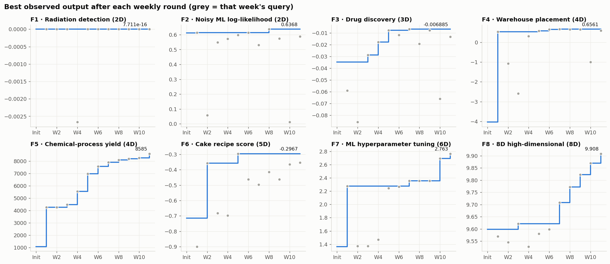
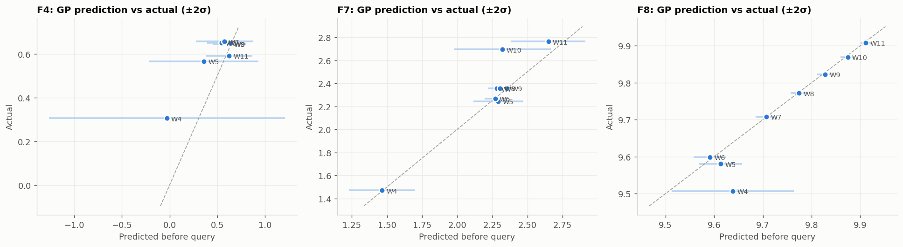

# Bayesian Black-Box Optimisation of Eight Unknown Functions

Capstone project, Imperial College Business School, Professional Certificate in Machine Learning and Artificial Intelligence.



## Non-technical explanation

Imagine eight locked machines. Each one has a few dials (two to eight), and it prints a score when you set them. The goal is the highest score possible on every machine, but you can only try one setting per machine per week, and nobody tells you how the machines work. This project shows how to choose each next try well. After every result I built a simple statistical "best guess" map of each machine. That map also shows where it is unsure, and I used it to decide whether to test a promising area or check an unknown one. Over eleven weeks, scores improved on seven of the eight machines, in one case almost eightfold.

## Data

- **Source:** the eight functions and their data are provided by the course portal and are not public. Each function started with a small initial sample (10–40 points). I then submitted **one query per function per week for 11 weeks** and recorded the returned output.
- **Format:** NumPy arrays. Inputs are `(n, d)` floats in `[0, 1]^d`, outputs are `(n,)` floats. Folder `data/initial_data` holds the starting sample, and `data/Wk_data` holds the data after week *k*'s result came back. Each snapshot contains the previous one.
- **Size:** small (≈ 100 KB in total), so it is stored directly in this repo. No external download is needed.
- **Full documentation:** see the [datasheet](DATASHEET.md).

| Fn | Scenario (course framing) | Dim | Initial points | Final points |
|----|---------------------------|-----|----------------|--------------|
| F1 | Radiation detection | 2 | 10 | 21 |
| F2 | Noisy ML log-likelihood | 2 | 10 | 21 |
| F3 | Drug discovery (negative by design) | 3 | 15 | 26 |
| F4 | Warehouse placement | 4 | 30 | 41 |
| F5 | Chemical-process yield | 4 | 20 | 31 |
| F6 | Cake recipe score (negative by design) | 5 | 20 | 31 |
| F7 | ML hyperparameter tuning | 6 | 30 | 41 |
| F8 | High-dimensional (8D) | 8 | 40 | 51 |

## Model

The core model is a **Gaussian Process (GP) surrogate** (scikit-learn), refit from scratch each week. A GP fits the observed points and also reports how uncertain it is everywhere else. That uncertainty is what makes principled exploration possible with only one query a week. Kernels were chosen per function: Matérn ½ for the non-smooth F3, Matérn 3/2–5/2 elsewhere, and a `WhiteKernel` noise term for noisy surfaces. All kernels use ARD length-scales.

The model was **not the same for every function**. Evidence each week pushed several functions to a better-suited strategy:

| Strategy | Used for | Why |
|----------|----------|-----|
| GP + UCB / EI | All functions, weeks 1–3; F2 | Standard BO starting point |
| **Trust-region GP + UCB** (TuRBO-style) | F8 (W7→), F7 (W10→) | Local GP is accurate when a global one is not (high-D, few points) |
| GP + **Probability of Improvement** in a shrinking box | F4 | One narrow positive peak; PI refuses to wander into the −4 surroundings |
| 1D **line search** | F5 | Clean monotone signal; no surrogate needed |
| Bootstrap MLP ensemble, Differential Evolution | F6–F8 (W4–W6), tried then dropped | Ensemble was miscalibrated at this sample size |
| Maximin space-filling | F1 | Surface returned ≈ 0 everywhere; nothing to exploit |
| Manual one-variable steps | F3, F6, F7 (some weeks) | Used when the calibration check said the GP's uncertainty could not be trusted |

Full details are in the [model card](MODEL_CARD.md).

## Hyperparameter optimisation

There are two layers of hyperparameters:

1. **Surrogate hyperparameters** (kernel amplitude, per-dimension length-scales, noise level). These are fitted by **maximising the GP marginal likelihood** (L-BFGS-B with 10 random restarts). They are re-learned every week, never hand-set.
2. **Optimiser hyperparameters** (acquisition function, UCB κ, trust-region half-widths, PI/EI ξ). These were chosen **adaptively from evidence**, using rules written down each week in `docs/handovers/`:
   - Lower κ after an improvement (exploit). Raise it after a miss or on a flat surface (explore).
   - Shrink the box around a sharp peak (F4: ±0.07 → ±0.010).
   - A standing **leave-one-out calibration check** (from W7). If any standardised residual has |z| > 3, the GP's uncertainty is not trusted and the step becomes local or manual.
   - **Back-testing:** refit the GP on only the data available before each query and compare its prediction with the actual result. This decided which surrogates were trusted (see Results).

Input warping (Beta-CDF, Snoek et al. 2014) was tried for F3 and **rejected**: the likelihood improved but calibration did not.

## Results

| Fn | Initial best | Final best (after W11) | Change |
|----|--------------|------------------------|--------|
| F1 | ≈ 0 | ≈ 0 | Flat everywhere; no signal found in 21 evaluations |
| F2 | 0.611 | 0.637 | Noise-limited (repeat queries vary by ±0.03) |
| F3 | −0.0348 | **−0.00689** | 5× closer to zero |
| F4 | −4.03 | **+0.656** | From all-negative to a confirmed positive peak |
| F5 | 1,089 | **8,585** | ×7.9; maximum at the boundary (all inputs = 0.999) |
| F6 | −0.714 | **−0.297** | Local optimum; every lever probed |
| F7 | 1.365 | **2.763** | +102%; breakthrough in W10 |
| F8 | 9.598 | **9.908** | New best in each of the last 5 weeks |

**How good was the surrogate?** Out-of-sample back-test over weeks 4–11 (notebook §8):

| Fn | Mean abs. error | Actual within ±2σ | Rank corr. (pred vs actual) |
|----|-----------------|--------------------|-----------------------------|
| F4 | 0.151 | 8/8 | 0.64 |
| F7 | 0.084 | 6/8 | 0.86 |
| F8 | **0.024** | 7/8 | **0.90** |



**What I learned**

- **No single method wins everywhere.** The biggest gains came from switching strategy per function when the evidence said so.
- **Go local when data is scarce.** A trust-region GP broke F8's three-week plateau, and its prediction (9.707) almost exactly matched the actual result (9.708).
- **Measure calibration rather than assume it.** The LOO and back-test checks decided where to trust the model and where to step manually.
- **Spend scarce queries where the marginal return is highest.** In the endgame, converged functions got re-confirmation queries and effort went to the functions still climbing.

## Repository structure

```
├── README.md                 ← you are here
├── DATASHEET.md              ← dataset documentation (all 8 functions)
├── MODEL_CARD.md             ← model documentation, performance, limitations
├── requirements.txt
├── notebooks/
│   └── bbo_capstone.ipynb    ← START HERE: method, results, diagnostics (pre-executed)
├── src/weekly/
│   └── weekN_bo.py           ← the exact script that produced week N's submission
├── data/
│   ├── initial_data/         ← starting sample per function
│   └── W1_data … W11_data/   ← dataset after each weekly result
├── figures/                  ← plots used in README and notebook
└── docs/
    ├── handovers/            ← weekly decision logs (results, queries, rationale)
    └── reflections/          ← module reflections, peer-insight notes
```

## How to reproduce

```bash
pip install -r requirements.txt
jupyter notebook notebooks/bbo_capstone.ipynb    # full story, runs in ~2 min
python src/weekly/week10_bo.py                   # regenerates the exact week-10 submission
```

Each `src/weekly/weekN_bo.py` reads the data snapshot available at the time (`data/W{N-1}_data`) and prints the queries in portal format (`0.123456-0.654321-…`). The scripts for weeks 3–10 reproduce the submitted queries exactly (fixed random seeds). Weeks 1–2 and 11–12 were generated interactively; their queries and reasoning are recorded in `docs/handovers/`.

## References

- Jones, Schonlau & Welch (1998). *Efficient Global Optimization of Expensive Black-Box Functions.*
- Srinivas et al. (2010). *Gaussian Process Optimization in the Bandit Setting* (GP-UCB).
- Snoek, Larochelle & Adams (2012). *Practical Bayesian Optimization of Machine Learning Algorithms.*
- Snoek, Swersky, Zemel & Adams (2014). *Input Warping for Bayesian Optimization of Non-Stationary Functions.*
- Eriksson et al. (2019). *Scalable Global Optimization via Local Bayesian Optimization* (TuRBO).
- Cowen-Rivers et al. (2020). *HEBO: Heteroscedastic Evolutionary Bayesian Optimisation.*
- Turner et al. (2021). *Bayesian Optimization is Superior to Random Search for Machine Learning Hyperparameter Tuning: Analysis of the Black-Box Optimization Challenge 2020.*

## Contact

GitHub: [@JasonThMdl](https://github.com/JasonThMdl)
